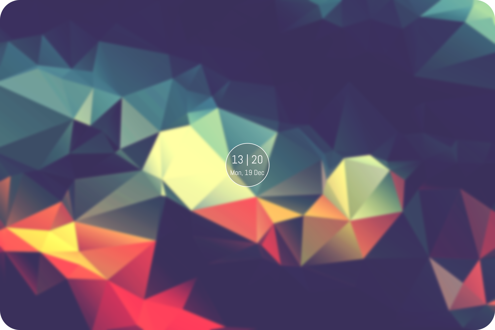

    

# ixlock3

A dead simple i3lock-color wrapper

## Dependencies
- `i3lock-color`
- `ttf-abel-regular`
- `imagemagick`

## Usage
    ./ixlock3 [options]
    -g (generate):   generate and cache lockscreen image
    -n (no-blur):    skip lockscreen image blur (ignored without '-g')
    -v (version):    show xdpi version and exit
    -h (help):       show usage and exit

## Execute on Suspend
    xss-lock /path/to/ixlock3

## Credits

Inspired by mantablockscreen, betterlockscreen, and some other i3lock-color wrappers, with a focus on simplicity. This program gives 1 (one) customized lockscreen with a lockscreen image caching option--nothing more.
